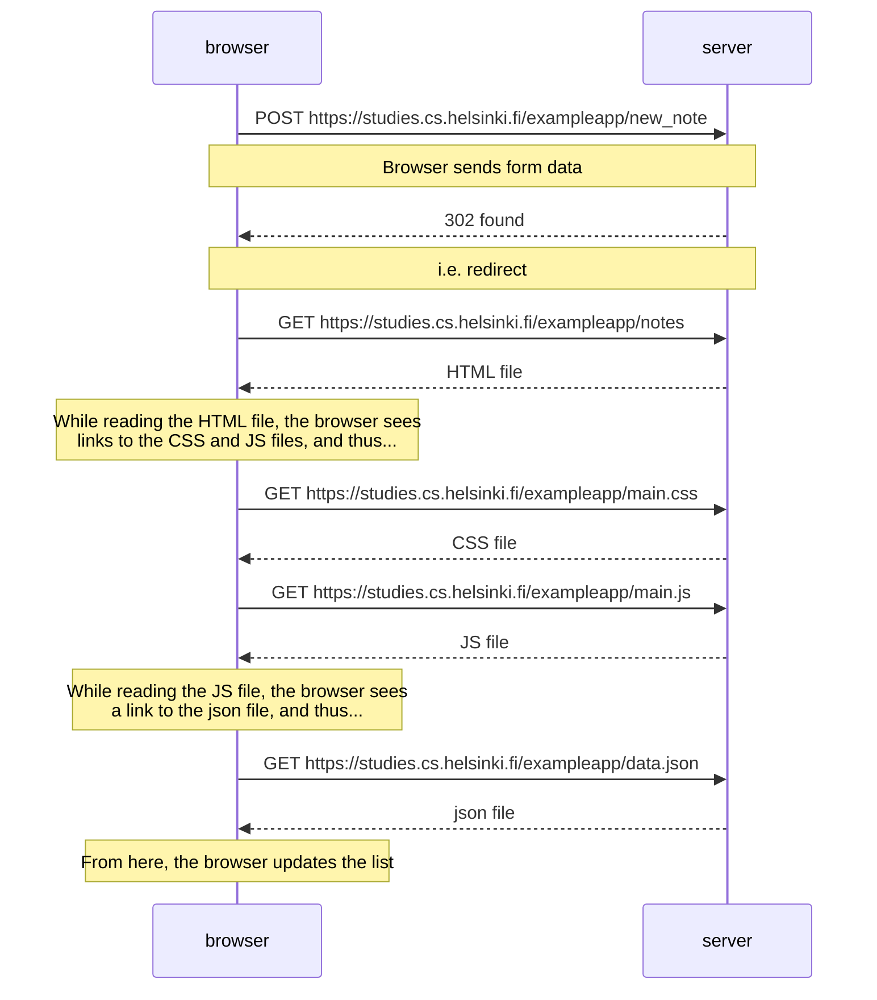

```mermaid
sequenceDiagram
    participant browser
    participant server
    browser ->> server: POST https://studies.cs.helsinki.fi/exampleapp/new_note
        Note over server,browser: Browser sends form data
    server -->> browser: 302 found
        Note over server,browser: i.e. redirect
    browser ->> server: GET https://studies.cs.helsinki.fi/exampleapp/notes
    server -->> browser: HTML file
        Note over browser: While reading the HTML file, the browser sees<br/>links to the CSS and JS files, and thus...
    browser ->> server: GET https://studies.cs.helsinki.fi/exampleapp/main.css
    server -->> browser: CSS file
    browser ->> server: GET https://studies.cs.helsinki.fi/exampleapp/main.js
    server -->> browser: JS file
                Note over browser: While reading the JS file, the browser sees<br/>a link to the json file, and thus...
    browser ->> server: GET https://studies.cs.helsinki.fi/exampleapp/data.json
    server -->> browser: json file
                    Note over browser: From here, the browser updates the list
```
