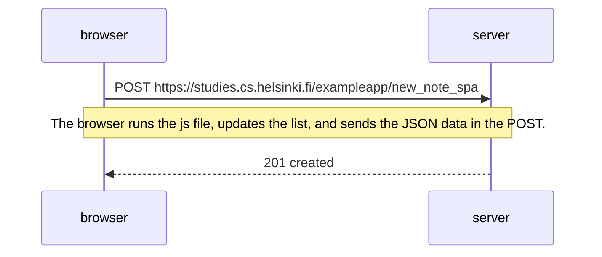

```mermaid
sequenceDiagram
    participant browser
    participant server
    browser ->> server: POST https://studies.cs.helsinki.fi/exampleapp/new_note_spa
            Note over server,browser: The browser runs the js file, updates the list, and sends the JSON data in the POST.
    server -->> browser: 201 created
```
